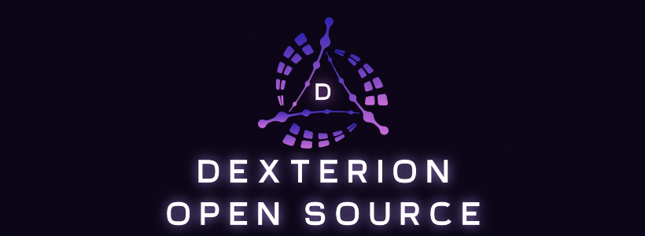



  

  

 

Welcome to **Dexterion**!\
This is a free, open-source tool created solely for educational purposes and testing [VAC (Valve Anti-Cheat)](https://help.steampowered.com/faqs/view/571A-97DA-70E9-FF74).

## Table of contents 
- [How To Use](#Howtouse)
- [Contributing](#Contributing)
- [Usage](#Usage)
- [Anti-Cheat](#Anti-Cheat)
- [Features](#Features)
- [IsThisVirus?](#IsThisVirus)
- [Credits](#Credits)
- [LICENSE](#License)
- [Disclaimer](#Disclaimer)
- [Previews](#Previews)

## HowtoUse
- You can see [Contributing](#Contributing) if you don't know how to compile you can directly download github automated build app in realese.

## Contributing
Download the code from the green button that says `Code`.
Extract the RAR file into any folder.
Open `Dexterion.sln` in Visual Studio 2022, set build configuration to **Release | x64**.
Press Build solution and you should receive **Dexterion.exe** file in the path `Dexterion/x64/Release/`

Little story about compiling the source:
Recently, some portuguese and russian kids asked if this was a virus. They ended up blocking me and I'll tell you how. They made me run the cheat, so I did and they still didn't believe it wasn't malware. They tried compiling the cheat and told me to help them. I was really trying to but they were retarded or something because the wasn't listening to me and didn't know how to extract the src. They blocked me after that failed attempt of extract the file. Don't be like those guys, please.

## Usage
### Update Offsets ( Choose 1 or 2 )
1. Update Offsets. (Run `updateoffsets.cmd` in the same folder as `Dexterion.exe`)
2. Manualy update from [a2x repo's](https://github.com/a2x/cs2-dumper/blob/main/output) the following files: `buttons.json`, `offsets.json`, `client_dll.json`.

> [!IMPORTANT]
   > Close Visual Studio to stop the released version that is ran automaticaly when you build.\
   > Then go to the `/x64/Release/` path and open dexterion.\
   > **If you use the version that was ran when you built the application this will be bugged.**
### Run
4. Run `Dexterion.exe` From release path
5. Follow Terminal instructions.
6. Wait For Load.

### Toggle/Kill UI
- Toggle UI: `Inset` key.
- Terminate UI: `End` key.

### Using Icon Fonts
Move fonts folder to the same folder as `Dexterion.exe` is.

### Config
All config files are located on `X:\Dexterion`
`X` will be the letter of the disk you're running dexterion on
#### Example:
- If you run `Dexterion.exe` in a pendrive which letter is `F:`, Dexterion config files will be in `F:\Dexterion`

## Anti-Cheat
> [!CAUTION]
> **This software constitutes a cheat and is in *violation of the Terms of Service (ToS)* of any game in which it is used. We disclaim all liability for any *account bans* or *penalties incurred* as a result of its use. By using this software, you acknowledge that you are solely responsible for any consequences. USE AT YOUR OWN RISK**

## Features
- ESP
  - Health bar (+ HP counter)
  - Player name
  - Weapon icons / names
  - Skeleton
  - Joints
  - Head
  - Snap lines
  - Distance
- Aim
  - Aimbot (+ Player lock)
  - Recoil control system
  - Trigger bot (random click delay)
- Misc
  - Bunny hop
  - Anti flash
  - Deathmatch Mode
  - Dropped item ESP
  - Bomb Timer
  - Spectator List

> [!CAUTION]
> **Bunny Hop, Anti-Flash, Fov are using write memory function from windows api and this could result in a ban.**

## IsThisVirus
- Short answer, no.
- But, as you are too lazy to view the source code, just don't use this.

## Credits
- [kristofhracza/tim_apple](https://github.com/kristofhracza/tim_apple) (Forked from this. Inspiration)
- [Patitotective/ImThemes](https://github.com/Patitotective/ImThemes)
- [a2x/cs2-dumper](https://github.com/a2x/cs2-dumper)
- [nlohmann/json](https://github.com/nlohmann/json)
- [ocornut/imgui](https://github.com/ocornut/imgui) 

## Disclaimer
> [!IMPORTANT]
> We are not responsible for any **banned accounts** and the **bad use** of this application.\
> This application was made for educational propurse to test the [VAC ( Valve Anti-Cheat )](https://help.steampowered.com/faqs/view/571A-97DA-70E9-FF74).\
> **USE AT YOUR OWN RISK**.

> [!NOTE]
> **This cheat is only tested on [VAC (Valve Anti-Cheat)](https://help.steampowered.com/faqs/view/571A-97DA-70E9-FF74) with non-writeMem features and `0` bans has been issued.**

## License
> [!NOTE]
> This repository is licensed under the [BSD-3](https://github.com/Skwrr/Dexterion/blob/master/LICENSE) Clause License.
> Any modified version of this source code is strictly prohibited from being sold under any circumstances. Modified versions must remain for private, personal use only, or be released as open-source software under the same [BSD-3](https://github.com/Skwrr/Dexterion/blob/master/LICENSE) Clause License. Any redistribution must include proper attribution and a hyperlink to the [original GitHub repository](https://github.com/Skwrr/Dexterion).

  

    <h2>Previews</h2>

